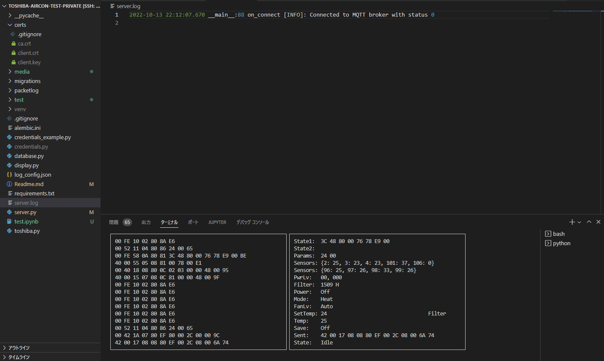
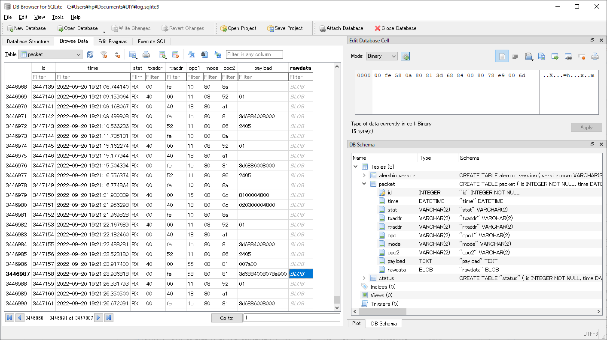
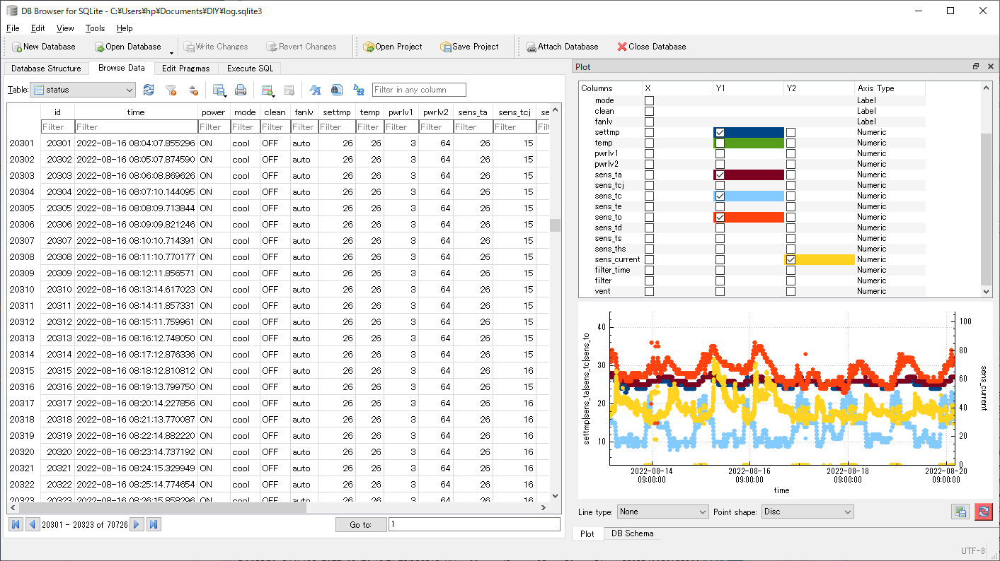

# toshiba-aircon-packet-processor

Packet processing server for Toshiba residential central air conditioner.  
Use [toshiba-aircon-mqtt-bridge](https://github.com/burrocargado/toshiba-aircon-mqtt-bridge) to interface the air conditioner indoor unit to the MQTT broker.  
Packet format may be different from model to model, modifications may be required to make this server work with a particular model of indoor unit.  
With some modifications, this server might be able to use with industrial air conditioners.

## Functions of the server

- Basic functions:
  - Subscribe to the MQTT topic 'aircon/packet/rx' and process received packets from the air conditiner indoor unit.
  - If any status change is processed, send the status to the topic 'aircon/status' in json format.
  - Generate and send query packets to the indoor unit via the topic 'aircon/packet/tx' to obtain data for sensors, power level and filter-runtime every 60 seconds.
  - Process query response packets and send the retrieved data to the topic 'aircon/update' in json format.
  - Subscribe to the topic "aircon/control" to receive control requests sent in json format from other MQTT clients, generate request packets and send them to the topic "aircon/packet/tx".
- Test and debug functions:
  - Record received and transmitted packets to SQLite database.
  - Record status and update data to the SQLite database.
  - Processing single-key testing commands while displaying curses window containing tx and rx packets in hex format, current status of the air conditiner.

## Install

Create and activate a Python virtual environment before installation is recommended.  
Python 3.8.10 is used for testing.

```shell
git clone https://github.com/burrocargado/toshiba-aircon-packet-processor
cd toshoba-aircon-packet-processor
python -m pip install -r requirements.txt
alembic upgrade head 
```

### Configuration for MQTT connection

Rename or copy mqtt.conf.example to mqtt.conf and edit it to add your broker settings.  
If server and/or client authentication is required, place the TLS related files in the certs folder and edit mqtt.conf to reflect the paths of the files:  
|File|Description|
|:----|:----|
|certs/ca.crt|CA certificate|
|certs/client.crt|Client certificate|
|certs/client.key|Client key|

## Usage

### Command line syntax

```shell
$ python server.py -h
usage: server.py [-h] [-i] [-p] [-s] [-r] [-v] -f CONFIG

packet processing server for Toshiba air conditioner

optional arguments:
  -h, --help            show this help message and exit
  -i, --interactive     enable interactive mode
  -p, --packetlog       enable packet logging to database
  -s, --statuslog       enable status logging to database
  -r, --receive-only    disable packet transmission
  -v, --verbose         set logging level to DEBUG
  -f CONFIG, --config CONFIG
                        specify configuration file
```

Be sure to specify mqtt.conf as config option:  

```shell
python server.py -f mqtt.conf
```

### Screen shot of VSCode displaying interactive terminal and logging data



## Debugging and development

You can analyze communication between the remote controller and the indoor unit using logged packet data stored in the SQLite database. [DB browser for SQLite](https://sqlitebrowser.org/) is convenient to explore the database.  
Receive only mode helps logging packets while avoid sending incompatible packets that may result in unpredictable damage to the facility.

### Example screen shot of DB browser for SQLite opening packet log



### Example screen shot of DB browser opening query data and status log



## Acknowledgements

The packet structure description given in [toshiba_air_cond](https://github.com/issalig/toshiba_air_cond) was very helpful in analyzing the packet structure for the indoor unit I'm using.

## Disclaimer

The safety and functionality of the software in this project are not guaranteed in any way. You could damage your facility, lose the manufacturer's warranty, or have your maintenance contract terminated. Use of this project is at your own risk.
